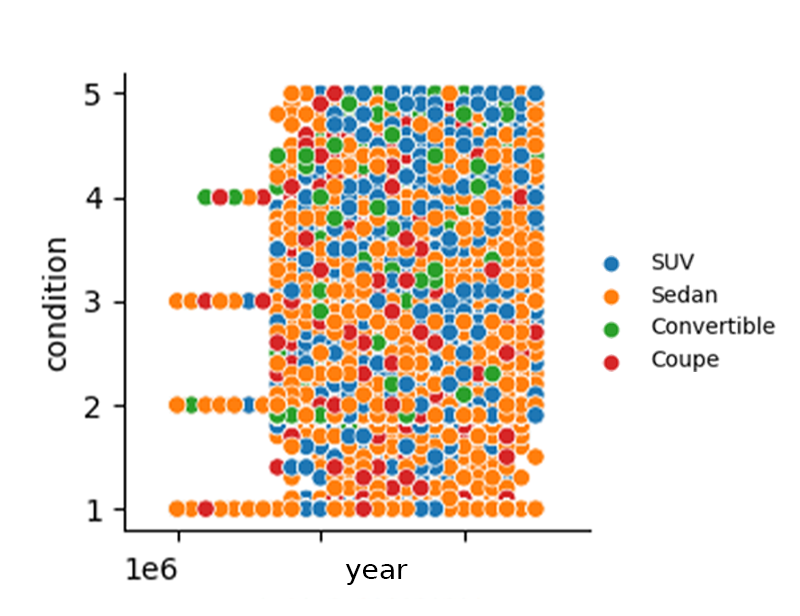

## 1. Introduction

### 1.1 Overview

The Car Sales Data Analysis Project aims to explore, analyze, and visualize
various factors that influence the selling prices of cars. By leveraging a
dataset containing information on car sales, we seek to uncover insights and
trends that can help stakeholders, such as car manufacturers, dealers, and
buyers, make informed decisions.

The dataset comprises various attributes, including the year of manufacture,
make, model, trim, body style, transmission type, Vehicle Identification Number
(VIN), state, condition, odometer reading, exterior color, interior color,
seller, Manheim Market Report (MMR) value, selling price, and sale date. This
comprehensive dataset offers ample opportunities to study the relationships
between these variables and car prices.

Using Python libraries such as NumPy, Pandas, Matplotlib, and Seaborn, we will
preprocess the data, perform exploratory data analysis, and create
visualizations to showcase our findings. The initial focus of our analysis will
be on body styles, comparing the distribution of different variables among SUVs,
Sedans, Convertibles, and Coupes. Further analyses will delve into other
factors, such as the impact of the car's age, make, and model on its selling
price.

This project aims to provide a comprehensive understanding of the factors
affecting car prices and to assist stakeholders in making data-driven decisions
in the automotive industry.

### 1.2 Libraries

- [seaborn](https://seaborn.pydata.org/)
- [NumPy](https://numpy.org/)
- [Matplotlib](https://matplotlib.org/)
- [pandas](https://pandas.pydata.org/)
- [SciPy](https://scipy.org/)

## 2. Sales Analysis

### 2.1 Data Example

| year | make | model   | trim | body | transmission | vin               | state | condition | odometer | color | interior | seller                  | mmr   | sellingprice | saledate                                |
| ---- | ---- | ------- | ---- | ---- | ------------ | ----------------- | ----- | --------- | -------- | ----- | -------- | ----------------------- | ----- | ------------ | --------------------------------------- |
| 2015 | Kia  | Sorento | LX   | SUV  | automatic    | 5xyktca69fg566472 | ca    | 5         | 16639    | white | black    | kia motors america, inc | 20500 | 21500        | Tue Dec 16 2014 12:30:00 GMT-0800 (PST) |

### 2.2 Columns

<ins>year</ins>: The year in which the car was manufactured.

<ins>make</ins>: The brand or manufacturer of the car (e.g., Kia, Ford, Toyota).

<ins>model</ins>: The specific model of the car produced by the manufacturer
(e.g., Sorento, Mustang, Camry).

<ins>trim</ins>: The particular package or configuration of the car model, which
may include different features, engine options, or styling (e.g., LX, GT, LE).

<ins>body</ins>: The body style of the car (e.g., SUV, Sedan, Convertible,
Coupe).

<ins>transmission</ins>: The type of transmission in the car, typically
automatic or manual.

<ins>vin</ins>: The Vehicle Identification Number (VIN), a unique identifier
assigned to each vehicle.

<ins>state</ins>: The two-letter abbreviation for the U.S. state where the car
was sold (e.g., CA for California).

<ins>condition</ins>: A numerical rating (on a scale of 1-5)
representing the overall condition of the car, with higher numbers indicating
better condition.

<ins>odometer</ins>: The number of miles recorded on the car's odometer at the
time of sale.

<ins>color</ins>: The exterior color of the car (e.g., white, black, red).

<ins>interior</ins>: The color or material of the car's interior (e.g., black
leather, beige cloth).

<ins>seller</ins>: The name or identifier of the entity that sold the car (e.g.,
a dealership or private seller).

<ins>mmr</ins>: The Manheim Market Report (MMR) value, an estimated wholesale
price based on historical sales data from the Manheim auto auction.

<ins>sellingprice</ins>: The actual price at which the car was sold.

<ins>saledate</ins>: The date and time when the car was sold, often including
the time zone (e.g., Tue Dec 16 2014 12:30:00 GMT-0800 (PST)).

### 2.2 Seaborn Analysis Full Plots

  

> Let's analyse some of the plots.

### 2.3 Car Condition - Make Year

  

- SUVs are generally kept in a prestine condition whether they are new or old.
- Sedan are all over the scale in this regard, although, comperatively they kept
the worst amongst the other groups.

### 2.4 Selling Price - Make Year

  

The value of the car seemingly increases as it hits the 10th year mark.

### 2.5 Selling Price - Wholesale Value

  

A linear graph on every type of car.

### 2.6 Heat Map

  

- mmr: almost has a perfect correlation with 0.98
- newer cars have a higher average condition
- negative correlation with the odometer suggests the older the car, the more
  the car has been driven.
- as the years get closer to today, the odometer tends to decrease.
- newer the car, higher mmr.
- more miles driven = worse condition, same goes for the age.

### 2.7 Odometer Comparison on Brands

  

Linear relationship plot comparing `odometer` (distance car has
travelled) vs. `sellingprice`, broken out by `make`.

<ins>Findings</ins>:

- BMW has a sharp decline, indicating that people do not trust the reliability
  of the brand. Each mile on BMW drops its value significantly, compared to the
  other brands.
- Toyata has the most shallow decrease in value over mileage.

<ins>Linear Regression Slope</ins>: For every increase in mile, the selling
price goes down by .1068 USD. 

### 2.8 Which Brand Loses the Most Value?

Ford: -0.099
BMW: -0.222
Toyota: -0.075
Chevrolet: -0.088

Toyata loses the least value at .075 cents for mile.

### 2.9 Categorical Variable Relationships

  

- Cars with prestine condition will sell over 20k USD.
- Cars with the worst condition will sell below 5k USD.

Now, this condition variable is very strong at explaining the delta in the
price. With this condition relationship, we can see that the condition is a very
useful indicator at differentiation selling price.

(<a href="#top">back to top</a>)

## 3. Feature Work

- Add price by condition analysis.
- Analyse FORD F-150.

(<a href="#top">back to top</a>)

<!-- CONTACT -->
## 4. Contact

Erol Gelbul - [Website](http://www.erolgelbul.com)

Project Link: [Used Car Sales](https://github.com/ErolGelbul/used_car_sales)

(<a href="#top">back to top</a>)

